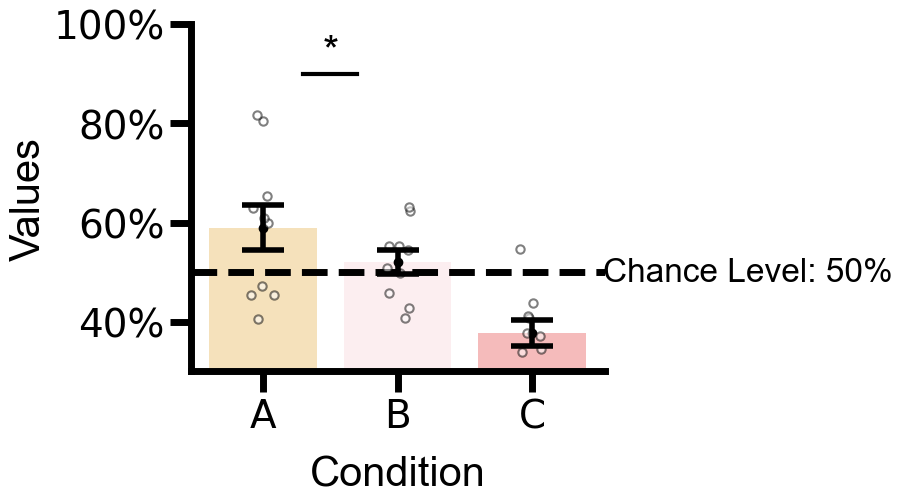

# statistics_Y_plot

`statistics_Y_plot` is a Python package for **fast statistical analysis and publication-quality visualization**.  
It provides easy-to-use wrappers for t-tests, repeated-measures ANOVA, and customized plots.


---

## Installation

```bash
pip install git+https://github.com/JennyWangw/statistics_Y_plot.git

```

---

## Key Features

1. **Automatic Statistical Analysis**  
   - Automatically handles missing data  
   - Automatically selects the appropriate t-test or Welch test based on variance equality  
   - Automatically performs post-hoc paired t-tests for ANOVA with Bonferroni correction  
   - Automatically annotates significance in summaries  


2. **High-quality Visualization**  
   - Generates publication-ready plots with scatter points and error bars
   - Designed with refined aesthetics suitable for academic papers
   - Supports percentage-formatted y-axis for proportions
   - Advanced customization: adjustable tick spacing, rotated labels, and flexible axis formatting



---
## 🧩 Quick Start

```python
from statistics_Y_plot import statistics_Y_plot
import numpy as np

# Initialize
sp = statistics_Y_plot(alpha=0.05)
```

## One-sample t-test

**Function**

```python
ttest_1samp_with_precheck(data, popmean=0)
```

**Example**

```python
data = [1.2, 2.4, np.nan, 3.1, 2.8]
res = sp.ttest_1samp_with_precheck(data, popmean=2)
print(res)
```

**Output**

```
Removed 1 NaN value(s) out of 5 total samples.
{'t': 1.414, 'p': 0.23, 'df': 3, 'mean': '2.3750', 'std': '0.7937', 'N_clean': 4}
```

---

## Independent t-test

**Function**

```python
ttest_ind_with_precheck(x, y)
```

**Example**

```python
x = [4.1, 5.2, 5.4, np.nan, 6.1]
y = [3.9, 4.2, 5.0, 4.8, 4.5]
res = sp.ttest_ind_with_precheck(x, y)
print(res)
```

**Output**

```
Removed 1 NaN(s) from x, 0 NaN(s) from y
{'t': 1.82, 'p': 0.11, 'df_t': 7.0, 'equal_var': True,
 'levene_stat': 0.01, 'levene_p': 0.91, 'levene_df1': 1, 'levene_df2': 7}
```

---

## Paired t-test

**Function**

```python
ttest_rel_with_precheck(x, y)
```

**Example**

```python
x = [1.2, 1.8, 2.0, np.nan, 2.1]
y = [1.5, 2.2, 2.1, 1.9, 2.5]
res = sp.ttest_rel_with_precheck(x, y)
print(res)
```

**Output**

```
Removed 1 sample(s) due to NaN in x or y
{'t': -3.67, 'p': 0.037, 'df': 3, 'n_removed': 1}
```

---

## One-factor Repeated-measures ANOVA

**Function**

```python
one_factor_rm_anova(data, factor_name='Condition')
```

**Input Format**

Each column = one condition
Each row = one subject

**Example**

```python
data = np.array([
    [1.2, 1.5, 2.0],
    [2.0, 2.3, 2.5],
    [1.8, 2.0, 2.4],
    [np.nan, 1.6, 2.1]
])

aov_table, posthoc = sp.one_factor_rm_anova(data, factor_name='Condition')
```

**Output**

```
deleted 1 subjects (3 subjects left)
           F Value  Num DF  Den DF  Pr > F    sig
Condition    8.75      2.0      4.0   0.037      *
```

---

## Two-factor Repeated-measures ANOVA

**Function**

```python
two_factor_rm_anova(data, factorA_name='FactorA', factorB_name='FactorB')
```

**Input Format**

Nested list → [FactorB][FactorA][Subjects]

**Example**

```python
data = [
    [[1.2, 1.5, 1.7], [1.9, 2.1, 2.0]],  # B1: A1, A2
    [[1.3, 1.4, 1.6], [2.2, 2.3, 2.4]]   # B2: A1, A2
]

aov_table, posthoc = sp.two_factor_rm_anova(data, 'A', 'B')
```

**Output**

```
           F Value  Num DF  Den DF  Pr > F    sig
A             9.03      1.0      2.0   0.033      *
B             7.22      1.0      2.0   0.045      *
A:B           0.80      1.0      2.0   0.46    n.s.
```

---

## Plotting

**Function**

```python
plot_with_scatter(data, xticklabels, plot='bar' or 'violin')
```

**Example**

```python
data = [np.random.rand(10)*5, np.random.rand(10)*6, np.random.rand(10)*7]
sp.plot_with_scatter(
    data=data,
    xticklabels=['Cond1', 'Cond2', 'Cond3'],
    plot='bar',
    xlabel='Condition',
    ylabel='Response Time (s)',
    percent_mode=None
)
plt.show()
```

This creates a **bar + scatter + error bar plot** with customizable aesthetics.

---

## Helper Function

**Convert nested data to long format**

```python
nested = [
    [[1,2,3], [2,3,4]],
    [[3,4,5], [5,6,7]]
]
df_long = sp.data_to_long(nested, 'A', 'B')
print(df_long.head())
```

**Output**

```
  Subject  A  B  Value
0      S1 A1 B1      1
1      S2 A1 B1      2
2      S3 A1 B1      3
3      S1 A2 B1      2
4      S2 A2 B1      3
```

---

## Summary

| Function                    | Purpose                                | Input Type     | Output                 |
| --------------------------- | -------------------------------------- | -------------- | ---------------------- |
| `ttest_1samp_with_precheck` | One-sample t-test with NaN check       | array          | dict                   |
| `ttest_ind_with_precheck`   | Independent t-test with Levene’s test  | 2 arrays       | dict                   |
| `ttest_rel_with_precheck`   | Paired t-test                          | 2 arrays       | dict                   |
| `one_factor_rm_anova`       | One-way repeated measures ANOVA        | 2D array       | (DataFrame, DataFrame) |
| `two_factor_rm_anova`       | Two-way repeated measures ANOVA        | nested list    | (DataFrame, dict)      |
| `plot_with_scatter`         | Plot bar/violin + scatter              | list of arrays | matplotlib object      |
| `data_to_long`              | Convert nested lists to long DataFrame | list           | DataFrame              |


